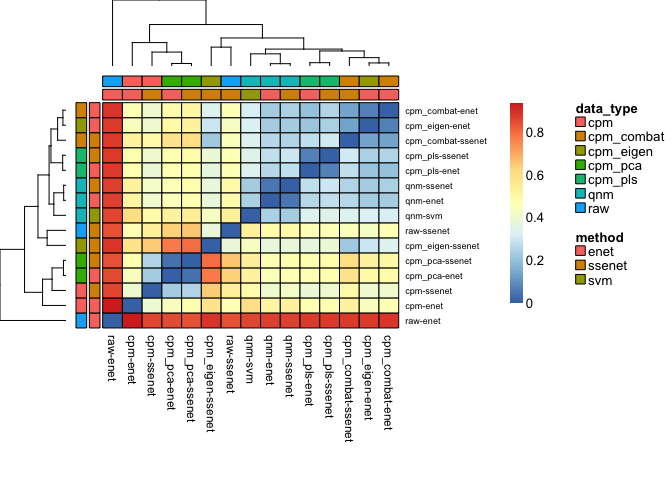

title: "Semi-Supervised Elastic Net (ssenet)" author: "Amrit Singh" date: "14 June, 2020"

Analysis for the Abstract Submission to \#BIRSBioIntegration [Mathematical Frameworks for Integrative Analysis of Emerging Biological Data Types](https://www.birs.ca/events/2020/5-day-workshops/20w5197)
==========================================================================================================================================================================================================

Zhu *et al* 2018: [seqFISH paper](https://www.nature.com/articles/nbt.4260)
---------------------------------------------------------------------------

-   43 genes (Supplementary Table 2) to map cell types in the seqFISH data:

### Step 1: mapping scRNASeq celltypes on seqFISH data

-   Randomly selected a subset of genes from the list of differentially expressed and applied a multiclass support vector machine; perform evaluated using cross-validation; 43 genes were used to map cell-types in the seqFISH data
-   Applied the SVM classification model to the bias-correct, quantile normalized seqFISH data to assign cell types.

``` r
library(ssenet); ## devtools::install_github("singha53/ssenet")
include_graphics("inst/extdata/suppTable2.png")
```


``` r
selectedGenes <- c("fbll1", "itpr2", "vps13c", "tnfrsf1b", "sox2",
  "hdx", "wrn", "sumf2", "vmn1r65", "rhob",
  "mrgprb1", "calb1", "pld1", "laptm5", "tbr1",
  "slc5a7", "abca9", "ankle1", "olr1", 
  "cecr2", "cpne5", "blzf1", "mertk",
  "nell1", "npy2r", "cdc5l", "slco1c1",
  "pax6", "cldn5", "cyp2j5", "mfge8",
  "col5a1", "bmpr1b", "rrm2", "gja1",
  "dcx", "spag6", "csf2rb2", "gda",
  "arhgef26", "slc4a8", "gm805", "omg")

plot(coord, col = mixOmics::color.mixo(as.numeric(seqfishLabels$V3)), pch = 21, 
  xlab = "x-coordinates", ylab = "y-coordinates")
points(coord, col = mixOmics::color.mixo(as.numeric(seqfishLabels$V3)), pch = 19)
```


### Step 2: a systemic approach to identify multicellular niche

-   HMRF (Hidden Markov Random Field): Systematically dissect the contributions of microenvironments on gene expression variation
-   Divide the visual cortex into domains with coherent gene expression patterns
-   HMRF enables the detection of spatial domains by systemically comparing the gene signature of each cell with its surrounding to search for coherent patterns
-   Domain state of each cell was influence by 2 sources: 1) gene expression pattern and 2) domain states of neighbouring cells
-   To enhance spatial domain detection 11 highly cell-specific genes were removed
-   HMRF revealed 9 spatial domains; four domains were in the outer layers of the cortex ( O1-O4), four domains were located on the inside of the cortex (I1A, I1B, I2, I3), domain IS was sporadically distributed across the inner layers of the cortex.

### Step 3: interactions between cell-type and spatial environment

-   The same cell-types expressed different genes depending on the domain state of the cell.
-   By visual inspection there were notable morphological variations near the boundary between different domains at multiple regions.

Questions for the BIRSBiointegration workshop:
==============================================

1) Can scRNA-seq data be overlaid onto seqFISH for resolution enhancement?
--------------------------------------------------------------------------

2) What is the minimal number of genes needed for data integration?
-------------------------------------------------------------------

3) Are there signatures of cellular co-localization or spatial coordinates in non-spatial scRNA-seq data?
---------------------------------------------------------------------------------------------------------

### remove cells with little data

``` r
# set constants
M = 2; iter = 2;
ncores = iter;
alpha = 1;
lambda_nfolds = 3;
family = "multinomial";
filter = "none";
max.iter = 20;
perc.full = 1;
thr.conf = 0.5;

## minimum number of samples required per cell-type class (required for hyperparameter tuning and cross-validation)
round(table(scrnaseqLabels$V1)/M/lambda_nfolds, 0)  # remove Oligodendrocyte.2
```

    ## 
    ##            Astrocyte     Endothelial Cell    GABA-ergic Neuron 
    ##                    7                    5                  127 
    ## Glutamatergic Neuron            Microglia    Oligodendrocyte.1 
    ##                  135                    4                    3 
    ##    Oligodendrocyte.2    Oligodendrocyte.3 
    ##                    1                    5

``` r
keepIndices <- which(scrnaseqLabels$V1 != "Oligodendrocyte.2")
xscrnaseq <- scrnaseq[, keepIndices]
yscrnaseq <- droplevels(scrnaseqLabels$V1[keepIndices])

## decrease dataset size for testing purposes 
keep_indx <- unlist(lapply(levels(yscrnaseq), function(i){
    na_index <- sample(x = which(yscrnaseq == i), size = min(table(yscrnaseq)))
  }))

xscrnaseq <- xscrnaseq[, keep_indx]
yscrnaseq <- yscrnaseq[keep_indx]

seqfish <- seqfish[, sample(ncol(seqfish), 50)]
```

Apply self-training to scRNA-seq with different levels of missingness
---------------------------------------------------------------------

``` r
estimate_error <- function(truth, pred) {
  mat <- table(factor(as.character(pred), levels = levels(truth)), truth)
  mat2 <- mat
  diag(mat2) <- 0
  classError <- colSums(mat2)/colSums(mat)
  er <- sum(mat2)/sum(mat)
  ber <- mean(classError)
  perfTest <- c(classError, er, ber)
  names(perfTest) <- c(names(classError), "ER", "BER")
  perfTest
}

set_na <- function(y, perc_na){
  unlist(lapply(levels(y), function(i){
    na_index <- sample(x = which(y == i), size = ceiling(length(which(y == i)) * perc_na))
  }))
}

## set a given number of observations to NA
p_missing <- c(0.1, 0.5)

err <- lapply(p_missing, function(perc_na){
  
  na_index <- set_na(yscrnaseq, perc_na)
  y_na <- yscrnaseq
  y_na[na_index] <- NA # remove class information of unlabeled instances
  
  # Elastic Net (fit on labeled and predict on unlabeled)
  alpha=1; lambda=NULL; lambda_nfolds=3; family = "multinomial"; filter="none";
  
  fitEnet <- enet(xtrain = t(xscrnaseq)[-na_index, ], 
                  ytrain = yscrnaseq[-na_index], 
                  alpha = alpha, 
                  lambda = lambda, 
                  lambda_nfolds = lambda_nfolds, 
                  family = family,
                  filter = filter, 
                  xtest = t(xscrnaseq)[na_index, ], 
                  ytest= yscrnaseq[na_index])
  result_enet <- estimate_error(truth=yscrnaseq[na_index], pred=fitEnet$predictResponse)
  
  # Semi-supervised Elastic Net 
  max.iter = 20;
  perc.full = 1;
  thr.conf = 0.5;
  xtest=NULL;
  ytest=NULL;
  useObsWeights = FALSE;
  keepVar = NULL;
  fitSSEnet <- ssenet(xtrain = t(xscrnaseq), 
                      ytrain= y_na, 
                      alpha = alpha, 
                      lambda = NULL, 
                      lambda_nfolds = lambda_nfolds, 
                      family = family, 
                      filter = filter,
                      max.iter = max.iter, perc.full = perc.full, thr.conf = thr.conf)
  result_ssenet <- estimate_error(truth=yscrnaseq[na_index], pred=fitSSEnet$ytrainImputed$pred[na_index])
  
  data.frame(enet=result_enet, ssenet=result_ssenet) %>% 
    mutate(name = rownames(.), perc_na = perc_na) %>% 
    gather(method, error, -c(name, perc_na))
}) %>% do.call(rbind, .)

## plot results
err %>% 
  filter(name=="BER") %>% 
  ggplot(aes(x = perc_na, y = error, color = method)) +
  geom_point() +
  geom_line() +
  xlim(0,1) +
  ylim(c(0,0.5)) +
  theme_bw() +
  ylab("Balanced Error Rate") +
  xlab("Percentage of missing data") +
  ggtitle("Comparing performance between enet and ssenet 
          by applying them to scRNA-seq data only
          with varying levels of missing data")
```


``` r
ggsave("scrnaseq_enet_vs_ssenet.pdf", width = 6, height = 3)
```

Explore scRNA-Seq and seqFISH datasets
--------------------------------------

### Histograms

``` r
combined_data <- rbind(t(xscrnaseq), t(seqfish))
rownames(combined_data) <- paste0("cell", 1:nrow(combined_data))
celltypes <- c(as.character(yscrnaseq), rep("seqFISH", ncol(seqfish)))
data_type <- rep(c("scRNA-seq", "seqFISH"), c(ncol(xscrnaseq), ncol(seqfish)))
combined_data %>% 
  as.data.frame() %>% 
  mutate(data = data_type) %>% 
  gather(gene, exp, -data) %>% 
  ggplot(aes(x=exp, fill=data)) +
  geom_histogram() +
  geom_density() +
  theme_bw() +
  ylab("Frequency") +
  xlab("Gene expression") +
  ggtitle("Histograms of scRNA-seq and seqFISH data")
```



``` r
ggsave("histogram_scrnaseq_seqfish.pdf", width = 6, height = 3)
```

### PCA

#### scRNA-Seq

``` r
pca_scrnaseq <- prcomp(t(xscrnaseq), scale. = TRUE)

fviz_pca_ind(pca_scrnaseq, label="none", col.ind="#F8766D",
  addEllipses=TRUE, ellipse.level=0.80) +
  ggtitle("PCA applied to scRNA-Seq")
```


``` r
ggsave("pca_scrnaseq.pdf", width = 3, height = 3)
```

#### seqFISH

``` r
pca_seqfish <- prcomp(t(seqfish), scale. = TRUE)

fviz_pca_ind(pca_seqfish, label="none", col.ind="#00BFC4",
  addEllipses=TRUE, ellipse.level=0.80) +
  ggtitle("PCA applied to seqFISH")
```


``` r
ggsave("pca_seqfish.pdf", width = 3, height = 3)
```

#### scRNA-Seq + seqFISH

``` r
pca <- prcomp(combined_data, scale. = TRUE)

fviz_pca_ind(pca, label="none", habillage=data_type,
  addEllipses=TRUE, ellipse.level=0.80) +
  theme(legend.position = "bottom") +
  ggtitle("PCA applied to scRNA-seq +
          seqFISH")
```


``` r
ggsave("pca_scrnaseq_seqfish.pdf", width = 3, height = 3)
```

#### scRNA-Seq + seqFISH (color by cell-type)

``` r
fviz_pca_ind(pca, label="none", habillage=celltypes,
  addEllipses=TRUE, ellipse.level=0.80) +
  theme(legend.position = "bottom") +
  ggtitle("PCA applied to scRNA-seq +
          seqFISH")
```


``` r
ggsave("pca_scrnaseq_seqfish_celltype.pdf", width = 6, height = 6)
```

Apply Enet to scRNAseq data and apply to seqFISH to determine cell-type labels
------------------------------------------------------------------------------

``` r
fitEnet <- enet(xtrain = t(xscrnaseq), ytrain = yscrnaseq, alpha = alpha, lambda = NULL, lambda_nfolds = lambda_nfolds, family = "multinomial", filter = filter)
cvEnet <- predict(object = fitEnet, M = M, iter = iter, ncores = ncores)
cvEnet$perf
```

    ## # A tibble: 9 x 3
    ##   ErrName                Mean     SD
    ##   <chr>                 <dbl>  <dbl>
    ## 1 Astrocyte            0      0     
    ## 2 BER                  0.180  0.0106
    ## 3 Endothelial Cell     0.132  0.112 
    ## 4 ER                   0.180  0.0106
    ## 5 GABA-ergic Neuron    0.395  0.0372
    ## 6 Glutamatergic Neuron 0.289  0.0372
    ## 7 Microglia            0      0     
    ## 8 Oligodendrocyte.1    0.0789 0.0372
    ## 9 Oligodendrocyte.3    0.368  0

Apply Semi-supervised Enet to scRNAseq+seqFISH data to determine cell-type labels
---------------------------------------------------------------------------------

``` r
fitSSEnet <- ssenet(xtrain = t(cbind(xscrnaseq, seqfish)), 
  ytrain=factor(c(as.character(yscrnaseq), rep(NA, ncol(seqfish)))), 
  alpha = alpha, lambda = fitEnet$lambda, lambda_nfolds = lambda_nfolds, family = "multinomial", 
  filter = filter,
  max.iter = max.iter, perc.full = perc.full, thr.conf = thr.conf)
cvSSEnet <- predict(object = fitSSEnet, M = M, iter = iter, ncores = ncores)
cvSSEnet$perf
```

    ## # A tibble: 9 x 3
    ##   ErrName                Mean     SD
    ##   <chr>                 <dbl>  <dbl>
    ## 1 Astrocyte            0.0263 0.0372
    ## 2 BER                  0.180  0.0213
    ## 3 Endothelial Cell     0.132  0.0372
    ## 4 ER                   0.180  0.0213
    ## 5 GABA-ergic Neuron    0.5    0.112 
    ## 6 Glutamatergic Neuron 0.184  0.0372
    ## 7 Microglia            0      0     
    ## 8 Oligodendrocyte.1    0.132  0.112 
    ## 9 Oligodendrocyte.3    0.289  0.0372

Compare supervised and semi-supervised Enet (Enet and SSEnet) performance using cross-validation
------------------------------------------------------------------------------------------------

``` r
cvErr <- rbind(cvEnet$perf, cvSSEnet$perf) %>% 
  mutate(method = rep(c("Enet", "SSEnet"), each = nrow(cvEnet$perf))) %>% 
  mutate(ErrName = factor(ErrName, c(levels(yscrnaseq), "ER", "BER")))
pd <- position_dodge(0.5)
cvErr %>% 
  ggplot(aes(x = ErrName, y = Mean, color = method)) +
  geom_errorbar(aes(ymin=Mean-SD, ymax=Mean+SD), width=.2, position=pd) +
  geom_line(position=pd) +
  geom_point(position=pd, size = 3) +
  theme_bw() +
  ylab("Average error rate (5x5 cross-validation)") +
  xlab("Cell-type, ER (error rate), BER (balanced error rate)") +
  customTheme(sizeStripFont = 15, xAngle = 40, hjust = 1, vjust = 1, 
    xSize = 10, ySize = 10, xAxisSize = 15, yAxisSize = 15)
```


``` r
ggsave("self_training_results.pdf", width = 6, height = 6)
```

| ErrName              |       Mean|         SD| method |
|:---------------------|----------:|----------:|:-------|
| Astrocyte            |  0.0000000|  0.0000000| Enet   |
| BER                  |  0.1804511|  0.0106332| Enet   |
| Endothelial Cell     |  0.1315789|  0.1116484| Enet   |
| ER                   |  0.1804511|  0.0106332| Enet   |
| GABA-ergic Neuron    |  0.3947368|  0.0372161| Enet   |
| Glutamatergic Neuron |  0.2894737|  0.0372161| Enet   |
| Microglia            |  0.0000000|  0.0000000| Enet   |
| Oligodendrocyte.1    |  0.0789474|  0.0372161| Enet   |
| Oligodendrocyte.3    |  0.3684211|  0.0000000| Enet   |
| Astrocyte            |  0.0263158|  0.0372161| SSEnet |
| BER                  |  0.1804511|  0.0212664| SSEnet |
| Endothelial Cell     |  0.1315789|  0.0372161| SSEnet |
| ER                   |  0.1804511|  0.0212664| SSEnet |
| GABA-ergic Neuron    |  0.5000000|  0.1116484| SSEnet |
| Glutamatergic Neuron |  0.1842105|  0.0372161| SSEnet |
| Microglia            |  0.0000000|  0.0000000| SSEnet |
| Oligodendrocyte.1    |  0.1315789|  0.1116484| SSEnet |
| Oligodendrocyte.3    |  0.2894737|  0.0372161| SSEnet |

Overlap between selected features with those used in the Nature paper (SVM)
---------------------------------------------------------------------------

``` r
panels = list(SVM = selectedGenes, Enet = fitEnet$enet.panel, SSEnet = fitSSEnet$enet.panel)

Input <- fromList(panels)
metadata <- data.frame(Methods=colnames(Input))
upset(Input, sets = colnames(Input))
```


Abstract
--------

### Your Name

> Amrit Singh

### Slack name on \#BIRSBioIntegration

> Amrit Singh

### Your Position

> trainee (post-doc)

### Name of supervisor

> Kim-Anh Le Cao/Bruce McManus

### Affiliation

> PROOF Centre of Excellence and The University of British Columbia

### Email

> <asingh@hli.ubc.ca>

### Co-authors

> none

### Which dataset(s) did you select for analysis?

> Spatial transcriptomics: seqFISH + scRNA-seq

### Why did you select this dataset(s) for analysis

> recommended by supervisor

### What integrative data analysis question have you addressed with the selected data and why?

> Can scRNA-seq data be overlaid onto seqFISH for resolution enhancement?

What are the advantages and performance of your approach? &gt; The published approach trained a multiclass SVM on the scRNAseq data and applied it to the seqFISH data to estimate the cell-types labels. My approach uses a penalized regression method (glmnet) with a semi-supervised appraoch in order to build a model using both the scRNAseq+seqFISH data. This strategy uses a recursive approach that invovles multiple rounds of training glmnet models using labeled data (label and imputed) and predicting the cell-type labels of unlabeled data. At each iteration, cell-type labels with high confidence (probability &gt; 0.5) are retained for the next iteration, where a new glmnet model is trained with the scRNAseq data and seqFISH data with imputed cell-type labels with high confidence. This process is repeated until all cell-types in the seqFISH data have been labeled or until 50 iterations have been reached (in order to reduce compute times). The advantage of this approach is that more data in used for model training such that the resulting model may generalize better to new data. The performance of this appraoch was estimated using cross-validation, using only the scRNAseq data as the test set.

### What were the specific challenges you have encountered so far?

> Compute times are significantly longer for the semi-supervised approach for model training. Thus, cross-validation takes even longer. The datasets are restricted to 113 genes and therefore the discovery space is very limited for the semi-supervised approach to learn classification rules that are superior to the supervised approach.

### How are you going to address those challenges?

> Cross-validation was parallelized such that each iteration of cross-validation was run on an independent cpu thread. If additional data is available for this study it may be better than the current results given that the genes are limited to those identified using the scRNAseq data only.

### Link to your preliminary code and results on a Github account (optional)

> <https://github.com/singha53/ssenet>

### Additional information you would like the organizers to know

> This is my first time looking at single cell data and this opportunity would expose me to knew methods, technologies and research in this field.

References
----------

1.  <https://github.com/mabelc/SSC>

[Data files](https://github.com/BIRSBiointegration/Hackathon/tree/master/seqFISH)
=================================================================================

``` r
# scrnaseq <- read.delim("inst/extdata/tasic_training_b2.txt", row.names = 1, header = FALSE)
# scrnaseqLabels <- read.delim("inst/extdata/tasic_labels.tsv", header = FALSE)
# seqfish <- read.delim("inst/extdata/seqfish_cortex_b2_testing.txt", row.names = 1, header = FALSE)
# seqfishLabels <- read.delim("inst/extdata/seqfish_labels.tsv", row.names = 1, header = FALSE)
# dim(scrnaseq); dim(scrnaseqLabels);
# dim(seqfish); dim(seqfishLabels);
# 
# coord <- read.delim("inst/extdata/fcortex.coordinates.txt", header = FALSE)
# coord <- lapply(1:nrow(coord), function(i){
#   as.numeric(strsplit(as.character(coord[i,]), " ")[[1]][-c(1, 2)])
# }) %>% 
#   do.call(rbind, .)
# dim(coord)
# 
# usethis::use_data(scrnaseq, overwrite = TRUE)
# usethis::use_data(scrnaseqLabels, overwrite = TRUE)
# usethis::use_data(seqfish, overwrite= TRUE)
# usethis::use_data(seqfishLabels, overwrite = TRUE)
# usethis::use_data(coord, overwrite = TRUE)
```
