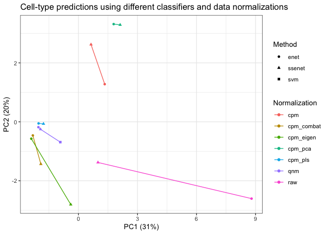

Semi-Supervised Elastic Net (ssenet)
================
Amrit Singh
29 June, 2020

Analysis for the Abstract Submission to \#BIRSBioIntegration [Mathematical Frameworks for Integrative Analysis of Emerging Biological Data Types](https://www.birs.ca/events/2020/5-day-workshops/20w5197)
==========================================================================================================================================================================================================

Zhu *et al* 2018: [seqFISH paper](https://www.nature.com/articles/nbt.4260)
---------------------------------------------------------------------------

-   43 genes (Supplementary Table 2) to map cell types in the seqFISH data:

### Step 1: mapping scRNASeq celltypes on seqFISH data

-   Randomly selected a subset of genes from the list of differentially expressed and applied a multiclass support vector machine; perform evaluated using cross-validation; 43 genes were used to map cell-types in the seqFISH data
-   Applied the SVM classification model to the bias-correct, quantile normalized seqFISH data to assign cell types.

``` r
library(ssenet); ## devtools::install_github("singha53/ssenet")
data("cortex"); data("qnmLabels"); data("coord");
include_graphics("inst/extdata/suppTable2.png")
```


``` r
selectedGenes <- c("fbll1", "itpr2", "vps13c", "tnfrsf1b", "sox2",
  "hdx", "wrn", "sumf2", "vmn1r65", "rhob",
  "mrgprb1", "calb1", "pld1", "laptm5", "tbr1",
  "slc5a7", "abca9", "ankle1", "olr1", 
  "cecr2", "cpne5", "blzf1", "mertk",
  "nell1", "npy2r", "cdc5l", "slco1c1",
  "pax6", "cldn5", "cyp2j5", "mfge8",
  "col5a1", "bmpr1b", "rrm2", "gja1",
  "dcx", "spag6", "csf2rb2", "gda",
  "arhgef26", "slc4a8", "gm805", "omg")

plot(coord, col = mixOmics::color.mixo(as.numeric(qnmLabels$seqfish$V3)), pch = 21, 
  xlab = "x-coordinates", ylab = "y-coordinates")
points(coord, col = mixOmics::color.mixo(as.numeric(qnmLabels$seqfish$V3)), pch = 19)
```


### Step 2: a systemic approach to identify multicellular niche

-   HMRF (Hidden Markov Random Field): Systematically dissect the contributions of microenvironments on gene expression variation
-   Divide the visual cortex into domains with coherent gene expression patterns
-   HMRF enables the detection of spatial domains by systemically comparing the gene signature of each cell with its surrounding to search for coherent patterns
-   Domain state of each cell was influence by 2 sources: 1) gene expression pattern and 2) domain states of neighbouring cells
-   To enhance spatial domain detection 11 highly cell-specific genes were removed
-   HMRF revealed 9 spatial domains; four domains were in the outer layers of the cortex ( O1-O4), four domains were located on the inside of the cortex (I1A, I1B, I2, I3), domain IS was sporadically distributed across the inner layers of the cortex.

### Step 3: interactions between cell-type and spatial environment

-   The same cell-types expressed different genes depending on the domain state of the cell.
-   By visual inspection there were notable morphological variations near the boundary between different domains at multiple regions.

Questions for the BIRSBiointegration workshop:
==============================================

1) Can scRNA-seq data be overlaid onto seqFISH for resolution enhancement?
--------------------------------------------------------------------------

2) What is the minimal number of genes needed for data integration?
-------------------------------------------------------------------

3) Are there signatures of cellular co-localization or spatial coordinates in non-spatial scRNA-seq data?
---------------------------------------------------------------------------------------------------------

### remove cells with little data

``` r
# set constants
M = 2; iter = 2;
ncores = iter;
alpha = 0;
lambda = NULL;
lambda_nfolds = 3;
family = "multinomial";
filter = "none";
max.iter = 10;
perc.full = 1;
thr.conf = 0.5;
keepVar = NULL;
weights = NULL;
xtest=NULL;
ytest=NULL;
useObsWeights = FALSE;

# minimum number of samples required per cell-type class (required for hyperparameter tuning and cross-validation)
round(table(qnmLabels$scrnaseq$V1)/M/lambda_nfolds, 0)  # remove Oligodendrocyte.2
```

    ## 
    ##            Astrocyte     Endothelial Cell    GABA-ergic Neuron 
    ##                    7                    5                  127 
    ## Glutamatergic Neuron            Microglia    Oligodendrocyte.1 
    ##                  135                    4                    3 
    ##    Oligodendrocyte.2    Oligodendrocyte.3 
    ##                    1                    5

``` r
keepIndices <- which(qnmLabels$scrnaseq$V1 != "Oligodendrocyte.2")

cortex$raw$scrnaseq <- cortex$raw$scrnaseq[keepIndices, ]
cortex$qnm$scrnaseq <- cortex$qnm$scrnaseq[keepIndices, ]
cortex$cpm$scrnaseq <- cortex$cpm$scrnaseq[keepIndices, ]
cortex$cpm_combat$scrnaseq <- cortex$cpm_combat$scrnaseq[keepIndices, ]
cortex$cpm_eigen$scrnaseq <- cortex$cpm_eigen$scrnaseq[keepIndices, ]
cortex$cpm_pca$scrnaseq <- cortex$cpm_pca$scrnaseq[keepIndices, ]
cortex$cpm_pls$scrnaseq <- cortex$cpm_pls$scrnaseq[keepIndices, ]
qnmLabels$scrnaseq <- qnmLabels$scrnaseq[keepIndices, ]
qnmLabels$scrnaseq$V1 <- droplevels(qnmLabels$scrnaseq$V1)
```

Compare cell-type label predictions using different methods and data normalizations
-----------------------------------------------------------------------------------

* see details of [data normalizations](https://github.com/singha53/ssenet/blob/test/inst/extdata/data_compilation.md)

``` r
data_norms <- names(cortex)
cl <- parallel::makeCluster(mc <- getOption("cl.cores", length(data_norms)))
parallel::clusterCall(cl, function() library("ssenet"))
```

    ## [[1]]
    ## [1] "ssenet"    "stats"     "graphics"  "grDevices" "utils"     "datasets" 
    ## [7] "methods"   "base"     
    ## 
    ## [[2]]
    ## [1] "ssenet"    "stats"     "graphics"  "grDevices" "utils"     "datasets" 
    ## [7] "methods"   "base"     
    ## 
    ## [[3]]
    ## [1] "ssenet"    "stats"     "graphics"  "grDevices" "utils"     "datasets" 
    ## [7] "methods"   "base"     
    ## 
    ## [[4]]
    ## [1] "ssenet"    "stats"     "graphics"  "grDevices" "utils"     "datasets" 
    ## [7] "methods"   "base"     
    ## 
    ## [[5]]
    ## [1] "ssenet"    "stats"     "graphics"  "grDevices" "utils"     "datasets" 
    ## [7] "methods"   "base"     
    ## 
    ## [[6]]
    ## [1] "ssenet"    "stats"     "graphics"  "grDevices" "utils"     "datasets" 
    ## [7] "methods"   "base"     
    ## 
    ## [[7]]
    ## [1] "ssenet"    "stats"     "graphics"  "grDevices" "utils"     "datasets" 
    ## [7] "methods"   "base"

``` r
parallel::clusterCall(cl, function() library("dplyr"))
```

    ## [[1]]
    ## [1] "dplyr"     "ssenet"    "stats"     "graphics"  "grDevices" "utils"    
    ## [7] "datasets"  "methods"   "base"     
    ## 
    ## [[2]]
    ## [1] "dplyr"     "ssenet"    "stats"     "graphics"  "grDevices" "utils"    
    ## [7] "datasets"  "methods"   "base"     
    ## 
    ## [[3]]
    ## [1] "dplyr"     "ssenet"    "stats"     "graphics"  "grDevices" "utils"    
    ## [7] "datasets"  "methods"   "base"     
    ## 
    ## [[4]]
    ## [1] "dplyr"     "ssenet"    "stats"     "graphics"  "grDevices" "utils"    
    ## [7] "datasets"  "methods"   "base"     
    ## 
    ## [[5]]
    ## [1] "dplyr"     "ssenet"    "stats"     "graphics"  "grDevices" "utils"    
    ## [7] "datasets"  "methods"   "base"     
    ## 
    ## [[6]]
    ## [1] "dplyr"     "ssenet"    "stats"     "graphics"  "grDevices" "utils"    
    ## [7] "datasets"  "methods"   "base"     
    ## 
    ## [[7]]
    ## [1] "dplyr"     "ssenet"    "stats"     "graphics"  "grDevices" "utils"    
    ## [7] "datasets"  "methods"   "base"

``` r
parallel::clusterExport(cl, varlist = c("data_norms", "cortex", "qnmLabels", "alpha", "lambda", 'lambda_nfolds', "family", "filter", "keepVar", "max.iter", "perc.full", "thr.conf", "useObsWeights"), envir = environment())
method_dataNorm_comp <- parallel::parLapply(cl, as.list(data_norms), function(data_norm, cortex, qnmLabels, alpha, lambda, lambda_nfolds, family, filter, keepVar, max.iter, perc.full, thr.conf, useObsWeights) {
  fitEnet <- enet(xtrain = cortex[[data_norm]]$scrnaseq, 
                  ytrain = qnmLabels$scrnaseq$V1, 
                  alpha = alpha, 
                  lambda = lambda, 
                  lambda_nfolds = lambda_nfolds, 
                  family = family,
                  filter = filter, 
                  xtest = cortex[[data_norm]]$seqfish, 
                  ytest= qnmLabels$seqfish$V3)
    
    # Semi-supervised Elastic Net 
    fitSSEnet <- ssenet(xtrain = rbind(cortex[[data_norm]]$scrnaseq, cortex[[data_norm]]$seqfish), 
                      ytrain= factor(c(as.character(qnmLabels$scrnaseq$V1), 
                                       rep(NA, nrow(cortex[[data_norm]]$seqfish)))), 
                      alpha = alpha, 
                      lambda = fitEnet$lambda, 
                      lambda_nfolds = lambda_nfolds, 
                      family = family, 
                      filter = filter,
                      max.iter = max.iter, 
                      perc.full = perc.full, 
                      thr.conf = thr.conf,
                      useObsWeights = useObsWeights)
  
  list(preds = data.frame(enet=as.character(fitEnet$predictResponse), 
             ssenet=fitSSEnet$ytrainImputed$pred[-c(1:nrow(cortex[[data_norm]]$scrnaseq))]) %>% 
    mutate(data_type=data_norm),
    panels = list(enet=fitEnet$enet.panel, ssenet=fitSSEnet$enet.panel))
}, cortex, qnmLabels, alpha, lambda, lambda_nfolds, family, filter, keepVar, max.iter, perc.full, thr.conf, useObsWeights) %>% ssenet::zip_nPure()
parallel::stopCluster(cl)


allpreds <- do.call(rbind, method_dataNorm_comp$preds) %>% 
  gather(method, celltypes, -data_type) %>% 
  rbind(., data.frame(data_type="qnm", method="svm", celltypes=as.character(qnmLabels$seqfish$V3))) %>% 
  mutate(data_type_method=paste(data_type, method, sep="-")) %>% 
  dplyr::select(data_type_method, celltypes) %>% 
  mutate(row_names = rep(1:nrow(cortex$raw$seqfish), length(cortex)*2+1)) %>% 
  spread(data_type_method, celltypes) %>% 
  dplyr::select(-row_names)
```

Compare methods and normalizations
----------------------------------

heatmap
-------

``` r
ggplotColours <- function(n = 6, h = c(0, 360) + 15){
  if ((diff(h) %% 360) < 1) h[2] <- h[2] - 360/n
  hcl(h = (seq(h[1], h[2], length = n)), c = 100, l = 65)
}
ann_colors <- list(data_type = ggplotColours(n=10),
                   method = ggplotColours(n=10))
labs <- colnames(gower.dist(t(allpreds)))
data_type <- strsplit(labs, "-") %>% sapply(., function(i){i[1]})
method <- strsplit(labs, "-") %>% sapply(., function(i){i[2]})
aheatmap(gower.dist(t(allpreds)),
         annRow = list(data_type=data_type, method=method),
         annCol = list(data_type=data_type, method=method),
         border_color = "black",  annColors = ann_colors)
```


PCA
---

``` r
pcs <- prcomp((1-gower.dist(t(allpreds))), scale. = TRUE, rank. = 2)

pcs$x %>% 
  as.data.frame() %>% 
  mutate(Normalization = data_type, Method = method) %>% 
  ggplot(aes(x = PC1, y = PC2, color = Normalization, shape = Method, group = Normalization)) +
  geom_point() +
  geom_line() +
  theme(legend.position = "bottom") +
  ggtitle("Cell-type predictions using different classifiers and data normalizations") +
  theme_bw() +
  xlab(paste0("PC1 (", round(100*pcs$sdev[1]/sum(pcs$sdev), 0), "%)")) +
  ylab(paste0("PC2 (", round(100*pcs$sdev[2]/sum(pcs$sdev), 0), "%)"))
```


