Semi-Supervised Elastic Net (ssenet) - data compilation
================
Amrit Singh
29 June, 2020

Import quantile normalized data from Zhu *et al* 2018: [seqFISH paper](https://www.nature.com/articles/nbt.4260)
================================================================================================================

-   <https://github.com/BIRSBiointegration/Hackathon/tree/master/seqFISH>

``` r
q_scrnaseq_data <- read.delim(here::here("inst", "extdata", "tasic_training_b2.txt"), row.names = 1, header = FALSE)
q_scrnaseq_cellLabels <- read.delim(here::here("inst", "extdata", "tasic_labels.tsv"), header = FALSE)
colnames(q_scrnaseq_data) <- gsub("-", ".", q_scrnaseq_cellLabels$V2)
all(ncol(q_scrnaseq_data) == nrow(q_scrnaseq_cellLabels)) ## do the number of cells match?
```

    ## [1] TRUE

``` r
q_seqfish_data <- read.delim(here::here("inst", "extdata", "seqfish_cortex_b2_testing.txt"), row.names = 1, header = FALSE)
q_seqfish_cellLabels <- read.delim(here::here("inst", "extdata", "seqfish_labels.tsv"), row.names = 1, header = FALSE)
all(ncol(q_seqfish_data) == nrow(q_seqfish_cellLabels)) ## do the number of cells match?
```

    ## [1] TRUE

``` r
all(rownames(q_scrnaseq_data) == rownames(q_seqfish_data)) ## are the genes in the same order in both datasets
```

    ## [1] TRUE

Import raw counts data from Zhu *et al* 2018: [seqFISH paper](https://www.nature.com/articles/nbt.4260)
=======================================================================================================

-   scRNASeq data (GSE71585\_RefSeq\_counts.csv.gz) obtained from GEO (<https://www.ncbi.nlm.nih.gov/geo/query/acc.cgi?acc=GSE71585>)
-   seqFISH data obatined from the Qian Zhu

``` r
# Import gene counts for scRNAseq and seqFISH data
seqfish_files <- grep("fcortex.gene", list.files(here::here("inst", "extdata", "seqfish_raw_gene_counts/genes"), full.names = TRUE), value = TRUE)
genes <- seqfish_files %>% 
  strsplit(., "fcortex.gene.") %>% 
  lapply(., function(i){ gsub(".txt", "", i[2]) }) %>% 
  unlist() %>% 
  tolower()

seqfish_data <- lapply(seqfish_files, function(i) { read.table(i, sep=' ', row.names = 1) }) %>% 
  do.call(cbind, .)
colnames(seqfish_data) <- genes
seqfish_data <- t(seqfish_data[, intersect(rownames(q_seqfish_data), genes)])
                 
## scrnaseq
scrnaseq_data <- read.csv(here::here("inst", "extdata","GSE71585_RefSeq_counts.csv"), row.names = 1) # https://www.ncbi.nlm.nih.gov/geo/query/acc.cgi?acc=GSE71585
rownames(scrnaseq_data) <- tolower(rownames(scrnaseq_data))
scrnaseq_data <- scrnaseq_data[intersect(rownames(q_scrnaseq_data), rownames(scrnaseq_data)), colnames(q_scrnaseq_data)]

## make sure all datasets have the same number of genes
common_genes <- Reduce(intersect, list(rownames(q_scrnaseq_data), 
                                       rownames(q_seqfish_data),
                                       rownames(scrnaseq_data),
                                       rownames(seqfish_data)))
seqfish_data <- seqfish_data[common_genes, ]
q_seqfish_data <- q_seqfish_data[common_genes, ]
scrnaseq_data <- scrnaseq_data[common_genes, ]
q_scrnaseq_data <- q_scrnaseq_data[common_genes, ]
```

Visual the scRNA-seq data and seqFISH quantile normalized data
--------------------------------------------------------------

### Histogram

``` r
combined_data <- rbind(t(q_scrnaseq_data), t(q_seqfish_data))
rownames(combined_data) <- paste0("cell", 1:nrow(combined_data))
celltypes <- c(as.character(q_scrnaseq_cellLabels$V1), rep("seqFISH", ncol(q_seqfish_data)))
data_type <- rep(c("scRNA-seq", "seqFISH"), c(ncol(q_scrnaseq_data), ncol(q_seqfish_data)))
combined_data %>% 
  as.data.frame() %>% 
  mutate(data = data_type) %>% 
  gather(gene, exp, -data) %>% 
  ggplot(aes(x=exp, fill=data)) +
  geom_histogram() +
  geom_density() +
  theme_bw() +
  ylab("Frequency") +
  xlab("Gene expression") +
  ggtitle("Histograms of scRNA-seq and seqFISH data")
```

    ## `stat_bin()` using `bins = 30`. Pick better value with `binwidth`.

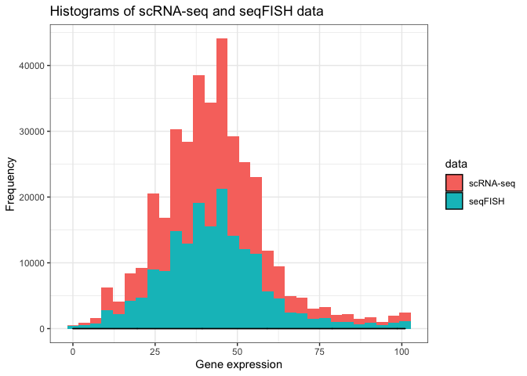

### PCA

``` r
pca <- prcomp(combined_data, scale. = TRUE)

fviz_pca_ind(pca, label="none", habillage=data_type,
  addEllipses=TRUE, ellipse.level=0.80) +
  theme(legend.position = "bottom") +
  ggtitle("PCA applied to scRNA-seq + seqFISH (Quantile normalized data)")
```

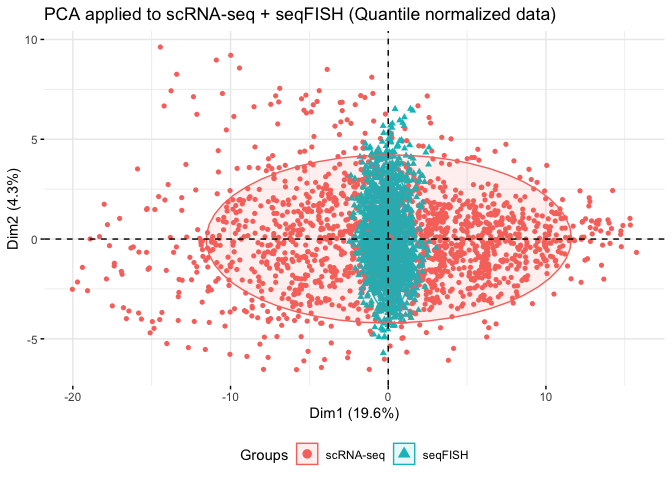

> data normalization issues between scRNA-seq and seqFISH data!

Visual the scRNA-seq data and seqFISH raw count data
----------------------------------------------------

### Histogram

``` r
combined_data <- rbind(t(scrnaseq_data), t(seqfish_data))
rownames(combined_data) <- paste0("cell", 1:nrow(combined_data))
data_type <- rep(c("scRNA-seq", "seqFISH"), c(ncol(scrnaseq_data), ncol(seqfish_data)))
combined_data %>% 
  as.data.frame() %>% 
  mutate(data = data_type) %>% 
  gather(gene, exp, -data) %>% 
  ggplot(aes(x=exp, fill=data)) +
  geom_histogram() +
  geom_density() +
  theme_bw() +
  scale_x_log10() +
  ylab("Frequency") +
  xlab("Gene expression") +
  ggtitle("Histograms of scRNA-seq and seqFISH data")
```

    ## Warning: Transformation introduced infinite values in continuous x-axis

    ## Warning: Transformation introduced infinite values in continuous x-axis

    ## `stat_bin()` using `bins = 30`. Pick better value with `binwidth`.

    ## Warning: Removed 169007 rows containing non-finite values (stat_bin).

    ## Warning: Removed 169007 rows containing non-finite values (stat_density).

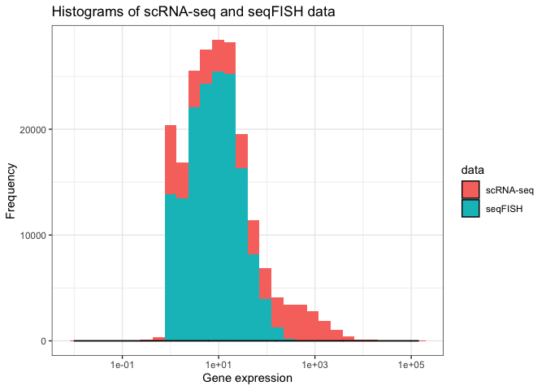

### PCA

#### Raw counts

``` r
pca <- prcomp(combined_data, scale. = TRUE)

fviz_pca_ind(pca, label="none", habillage=data_type,
  addEllipses=TRUE, ellipse.level=0.80) +
  theme(legend.position = "bottom") +
  ggtitle("PCA applied to scRNA-seq + seqFISH (Raw counts)")
```

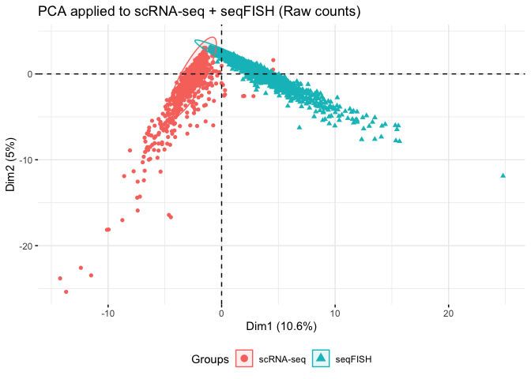

### GLM-PCA

#### Raw counts

``` r
families <- c("poi", "mult")
lapply(families, function(i){
  glmpca(t(combined_data), L=2, fam = i)$factors
}) %>% 
  do.call(rbind, .) %>% 
  mutate(family = rep(families, each = nrow(combined_data)),
         data_type = rep(data_type, length(families))) %>% 
  ggplot(aes(x = dim1, y=dim2, color = data_type)) +
  geom_point() +
  facet_wrap(~family) + 
  theme(legend.position = "bottom") +
  ggtitle("GLM-PCA applied to scRNA-seq + seqFISH (Raw counts)")
```

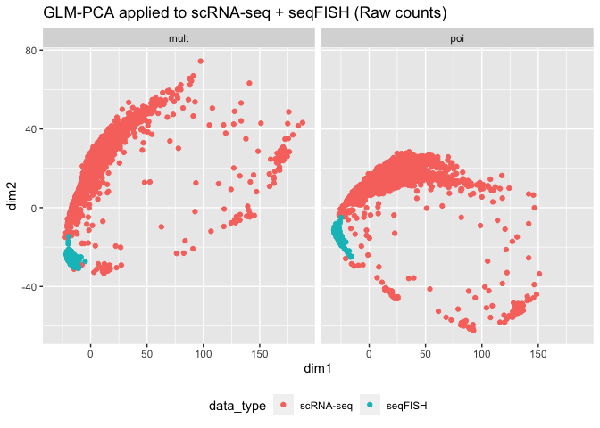

> considerable differences between data distributions

#### log2 CPM: t(log2(t(counts + 0.5)/(lib.size + 1) \* 1e+06))

``` r
cpm_scrnaseq_data <- log2(t(t(scrnaseq_data) + 0.5)/(colSums(t(scrnaseq_data)) + 1) * 1e+06)
cpm_seqfish_data <- log2(t(t(seqfish_data) + 0.5)/(colSums(t(seqfish_data)) + 1) * 1e+06)
cpm <- cbind(cpm_scrnaseq_data, cpm_seqfish_data)
pca <- prcomp(t(cpm), scale. = TRUE)

fviz_pca_ind(pca, label="none", habillage=data_type,
  addEllipses=TRUE, ellipse.level=0.80) +
  theme(legend.position = "bottom") +
  ggtitle("PCA applied to scRNA-seq + seqFISH (log2 CPM)")
```

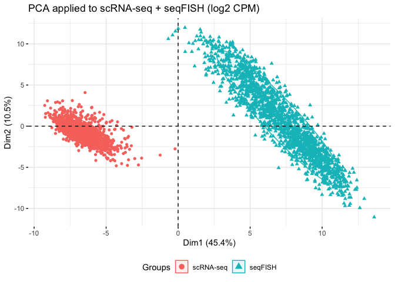

### Eigenvalue correction

``` r
cpm_eigen_scrnaseq <- scale(t(cpm_scrnaseq_data))/pca(t(cpm_scrnaseq_data), scale=TRUE)$sdev[1]
cpm_eigen_seqfish <- scale(t(cpm_seqfish_data))/pca(t(cpm_seqfish_data), scale=TRUE)$sdev[1]
cpm <- rbind(cpm_eigen_scrnaseq, cpm_eigen_seqfish)

pca_eigenvalue <- prcomp(cpm, scale. = FALSE)

fviz_pca_ind(pca_eigenvalue, label="none", habillage=data_type,
  addEllipses=TRUE, ellipse.level=0.80) +
  theme(legend.position = "bottom") +
  ggtitle("PCA applied to scRNA-seq + seqFISH (log2 CPM scaled by the Eigenvalue)")
```

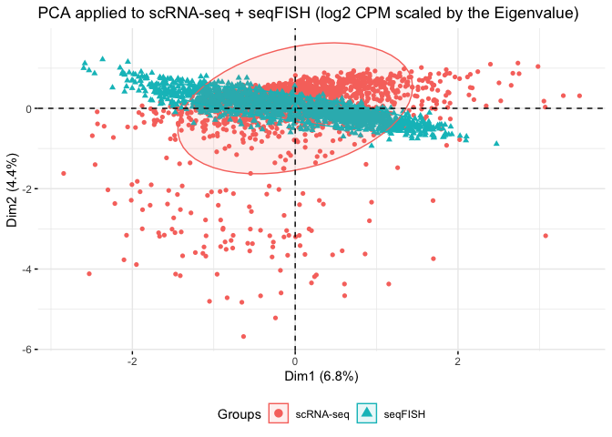

``` r
pca_eigenvalue$x[1:ncol(cpm_scrnaseq_data), 1] <- -pca_eigenvalue$x[1:ncol(cpm_scrnaseq_data), 1]
pca_eigenvalue$x %>% 
  as.data.frame() %>% 
  mutate(data_type = data_type) %>% 
  ggplot(aes(x = PC1, y = PC2, color=data_type)) +
  geom_point() +
  stat_ellipse()
```

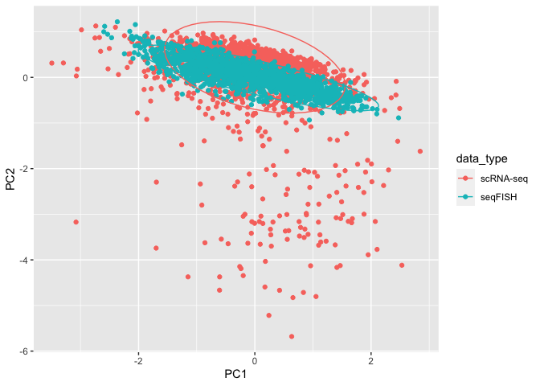

### Combat correction

``` r
cpm <- cbind(cpm_scrnaseq_data, cpm_seqfish_data)
combat_cpm = ComBat(dat=cpm, batch=data_type, mod=NULL, par.prior=TRUE, prior.plots=FALSE)
```

    ## Found2batches

    ## Adjusting for0covariate(s) or covariate level(s)

    ## Standardizing Data across genes

    ## Fitting L/S model and finding priors

    ## Finding parametric adjustments

    ## Adjusting the Data

``` r
cpm_combat_scrnaseq <- t(combat_cpm[, colnames(cpm_scrnaseq_data)])
cpm_combat_seqfish <- t(combat_cpm[, colnames(cpm_seqfish_data)])

pca <- prcomp(t(combat_cpm), scale. = TRUE)

fviz_pca_ind(pca, label="none", habillage=data_type,
  addEllipses=TRUE, ellipse.level=0.80) +
  theme(legend.position = "bottom") +
  ggtitle("PCA applied to scRNA-seq + seqFISH (log2 CPM Combat corrected)")
```

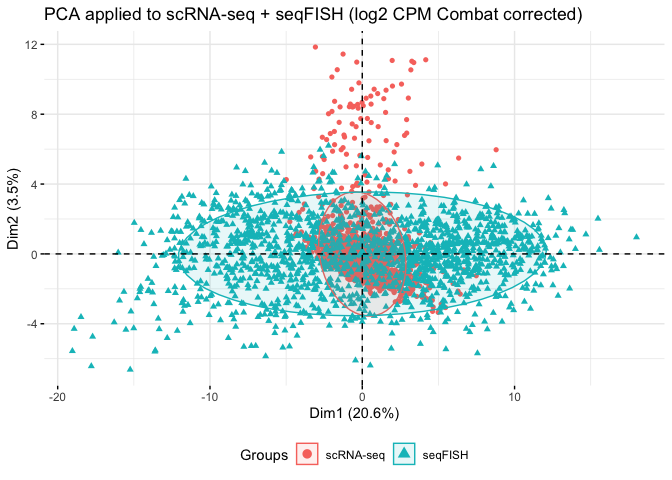

### extract common sources of variation using Partial Least Squares

#### PLS

``` r
result <- pls(cpm_scrnaseq_data, cpm_seqfish_data, scale = TRUE)
```

##### Correlation between X and V variates (variables)

``` r
plot(result$variates$Y[,1] ~ result$variates$X[,1])
abline(lm(result$variates$Y[,1] ~ result$variates$X[,1]))
```

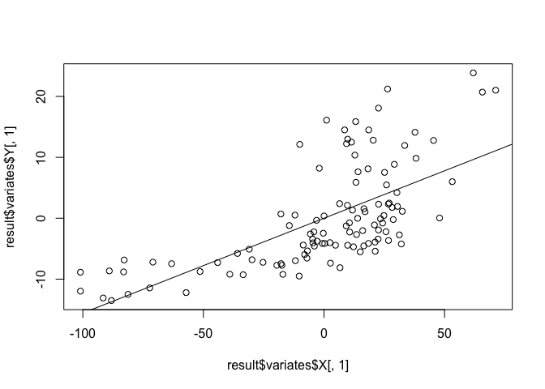

##### X and Y loadings (samples)

``` r
rbind(result$loadings$X, result$loadings$Y) %>% 
  as.data.frame() %>% 
  mutate(data_type = data_type) %>% 
  ggplot(aes(x = comp1, y = comp2, color=data_type)) +
  geom_point() +
  stat_ellipse()
```

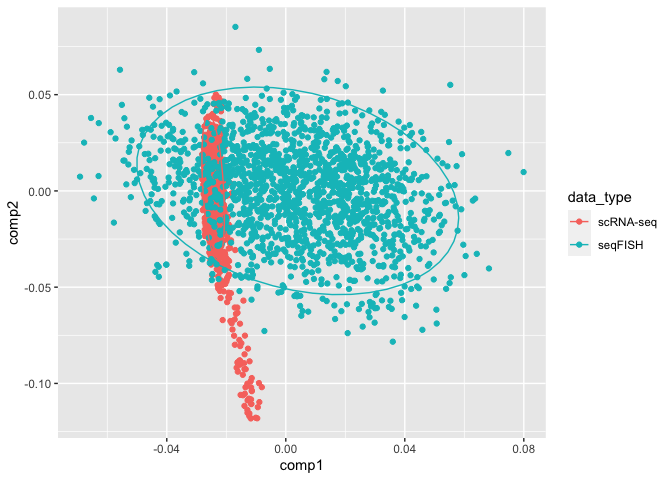

#### PLS with Eigenvalue scaling

``` r
pls_eigenvalue <- pls(t(cpm_eigen_scrnaseq), t(cpm_eigen_seqfish), 
                      scale = FALSE, 
                      ncomp = ncol(cpm_eigen_scrnaseq))
```

##### Correlation between X and V variates (variables)

``` r
plot(pls_eigenvalue$variates$Y[,1] ~ pls_eigenvalue$variates$X[,1])
abline(lm(pls_eigenvalue$variates$Y[,1] ~ pls_eigenvalue$variates$X[,1]))
```

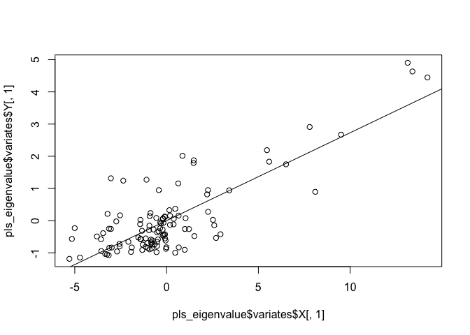

##### X and Y loadings (samples)

``` r
rbind(pls_eigenvalue$loadings$X, pls_eigenvalue$loadings$Y) %>% 
  as.data.frame() %>% 
  mutate(data_type = data_type) %>% 
  ggplot(aes(x = comp1, y = comp2, color = data_type)) +
  geom_point() +
  stat_ellipse()
```

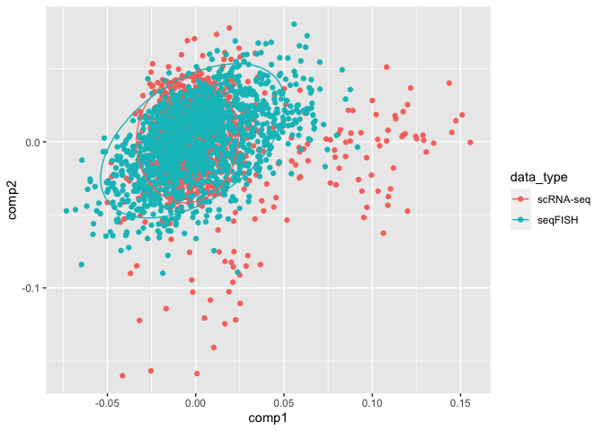

Save datasets
-------------

``` r
## raw data
## quantile normalized data
## CPM
## CPM - standardized+eigenvalueScaling
## variates from PCA applied to CPM - standardized+eigenvalueScaling
## variates from PLS applied to CPM - standardized+eigenvalueScaling

cortex <- list(raw = list(scrnaseq = t(scrnaseq_data), seqfish = t(seqfish_data)),
     qnm = list(scrnaseq = t(q_scrnaseq_data), seqfish = t(q_seqfish_data)),
     cpm = list(scrnaseq = t(cpm_scrnaseq_data), seqfish = t(cpm_seqfish_data)),
     cpm_combat = list(scrnaseq = cpm_combat_scrnaseq, seqfish = cpm_combat_seqfish),
     cpm_eigen = list(scrnaseq = cpm_eigen_scrnaseq, seqfish = cpm_eigen_seqfish),
     cpm_pca = list(scrnaseq = pca_eigenvalue$x[rownames(cpm_eigen_scrnaseq), ], 
                    seqfish = pca_eigenvalue$x[rownames(cpm_eigen_seqfish), ]),
     cpm_pls = list(scrnaseq = pls_eigenvalue$loadings$X, seqfish = pls_eigenvalue$loadings$Y))

qnmLabels <- list(scrnaseq=q_scrnaseq_cellLabels, 
                    seqfish=q_seqfish_cellLabels)

coord <- read.table(here::here("inst", "extdata", "fcortex.coordinates.txt"), sep=' ', header = FALSE)[, 3:4]
colnames(coord) <- c("x", "y")

usethis::use_data(cortex, overwrite = TRUE)
```

    ## ✓ Setting active project to '/Users/asingh/Documents/ubc/Conferences/2020/Banff/ssenet'

    ## ✓ Saving 'cortex' to 'data/cortex.rda'

    ## ● Document your data (see 'https://r-pkgs.org/data.html')

``` r
usethis::use_data(qnmLabels, overwrite = TRUE)
```

    ## ✓ Saving 'qnmLabels' to 'data/qnmLabels.rda'
    ## ● Document your data (see 'https://r-pkgs.org/data.html')

``` r
usethis::use_data(coord, overwrite = TRUE)
```

    ## ✓ Saving 'coord' to 'data/coord.rda'
    ## ● Document your data (see 'https://r-pkgs.org/data.html')
